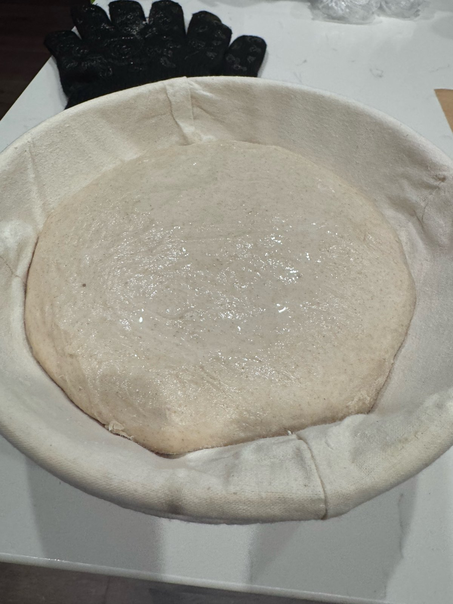
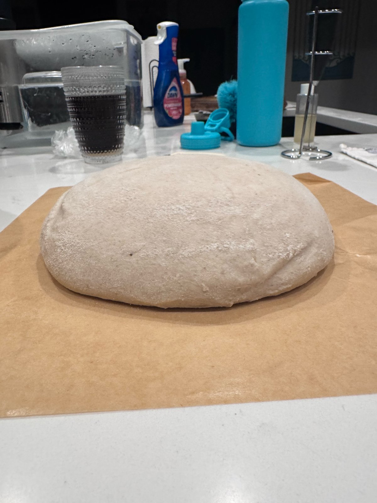
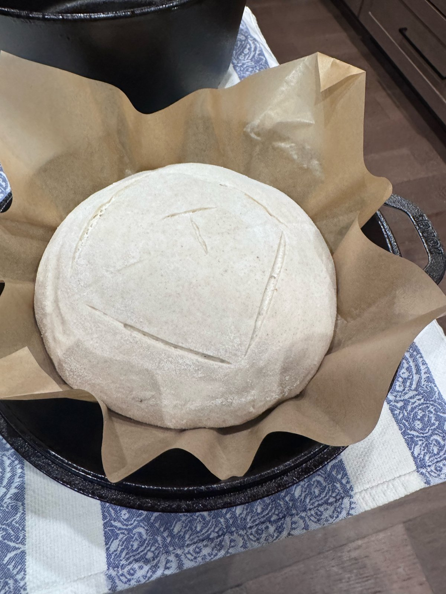
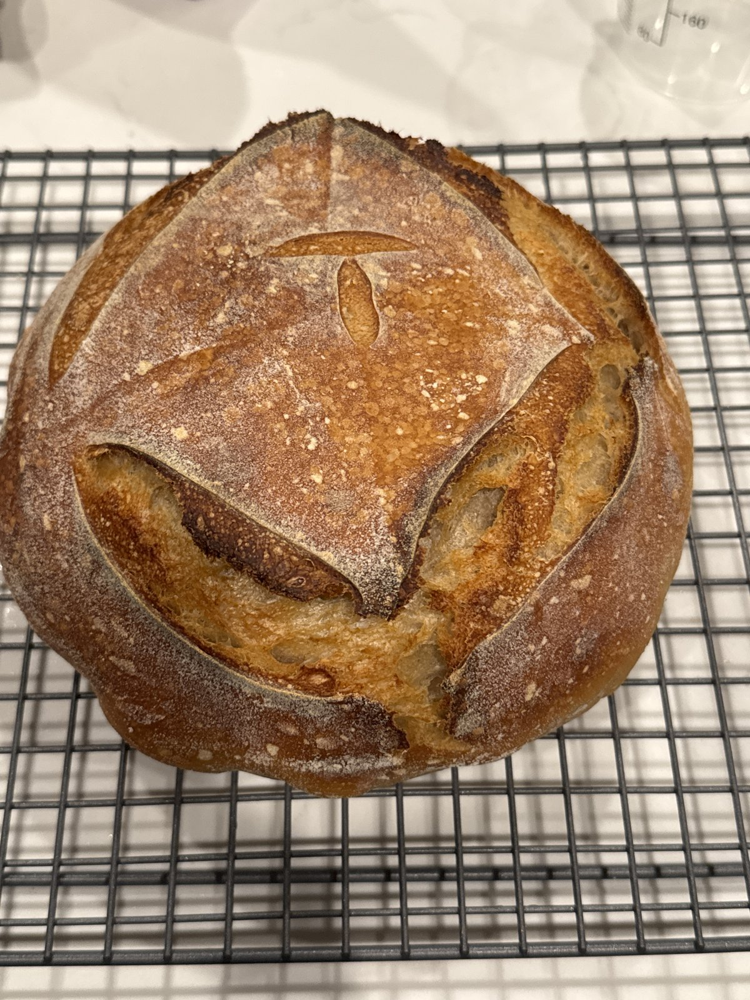
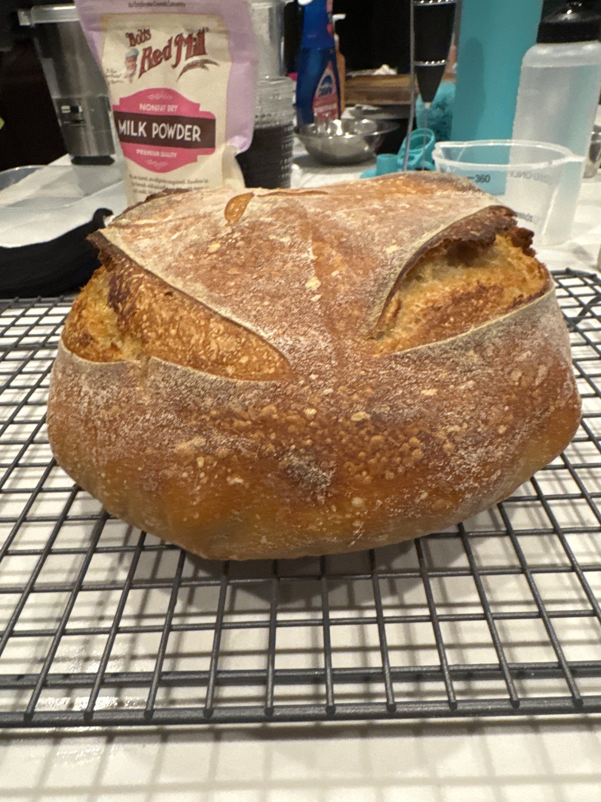
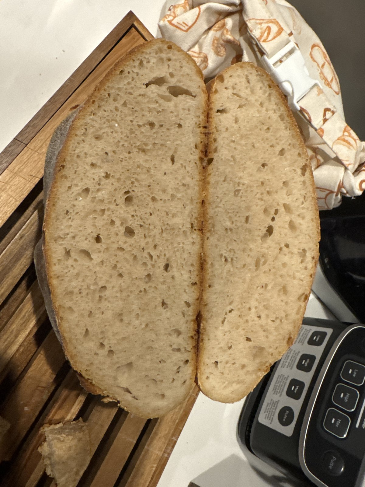

# Bake 007 — Carl.7

**Mixed:** 2026-09-30 · **Baked:** 2026-10-01 · **Status:** ✅ done

| Variable | Value |
|----------|-------|
| Formula | 500 flour / 340 water / 100 Carl / 10 salt (baseline boule, ~950 g dough) |
| Mix | ~**1030** (9/30) |
| Dough temp after mix | **78.4°F** — top of target range |
| Rest | 45 min |
| Salt | **Correct** — added after the 45-min rest, ~**1120–1130** |
| Dough temp after salt | **76.6°F** |
| Bulk start | ~**1130** — in the oven with the light **off** (~78°F) |
| Folds | **0** |
| Bulk end | Dough slack by ~**1719** → shaped right away with extra tension |
| Final shape → retard | **1725** @ 35°F (fridge) — banneton |
| Cold proof | ~**12.75 hr** (1725 → load ~0610) |
| Preheat | Oven + Lodge Double Dutch set to 475°F at **0445** — oven climbs slowly; ~85 min of heat by load |
| Score | Box + T |
| Load | ~**0610** → 450°F covered |
| Finish | Lid off ~**0630** → 425°F |
| Internal | **208°F** — pulled |
| Crust | Strong oven spring, tall even dome; box + T opened evenly with an ear on one side; golden-amber — the softer, lighter crust Jerrod prefers |
| Baked weight | **808.8 g** (~14.9% loss from ~950 g dough) — heaviest loaf so far (Carl.6 800 g, Carl.4 758.4 g, Carl.5 735.1 g) |
| Crumb | Even top to bottom; small-to-medium holes; no gummy streak, no dense base, no tunnels — tighter, sandwich-friendly crumb |

## Notes

Back on track after Carl.6's salt-early rescue: salt went in after the 45-minute rest this time. Bulk ran in the oven with the light off (~78°F) — no preheat accidents. The dough went slack by ~1719, so it skipped straight to a final shape with extra tension and into the fridge at 1725.

**Baked 2026-10-01.** Strong spring and a tall, even dome; the box + T opened evenly with an ear on one side. Golden-amber, softer crust. Crumb is even throughout with no gummy streak, dense base, or tunnels.

**Ranking:** neck and neck with Carl.4 (previous best) — and the **best sandwich loaf so far**.

## Photos

| | |
|---|---|
|  |  |
| Proofed, out of the fridge | Turned out — holding its shape |
|  |  |
| Scored (box + T) | Baked — top |
|  |  |
| Baked — side | Crumb |
