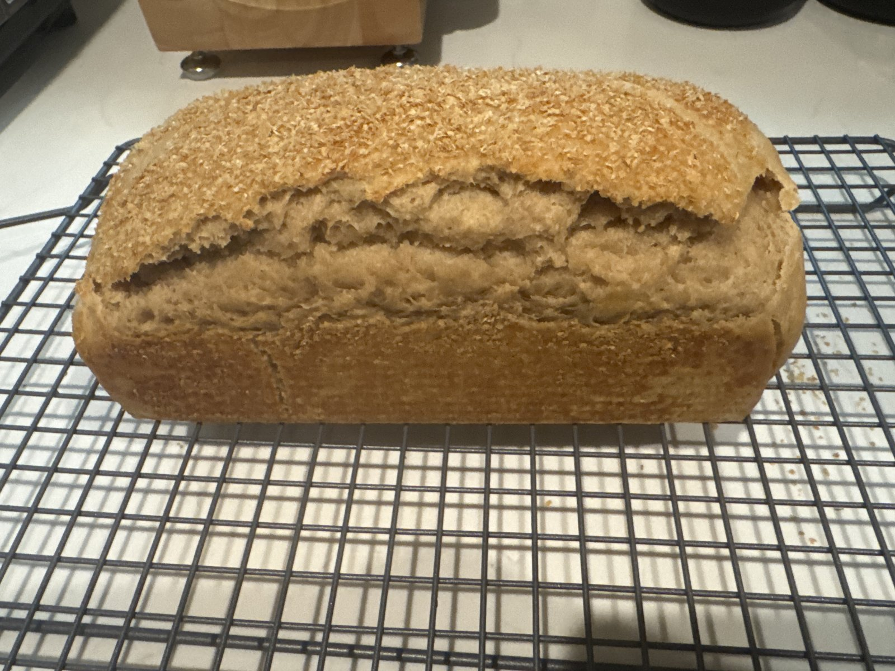

# Rend 004 — Rend.4

**Mixed:** 2026-10-01 · **Baked:** 2026-10-01 · **Status:** ✅ done

| Variable | Value |
|----------|-------|
| Made | Sourdough milk bread — USA Pan 9×4 Pullman loaf |
| Discard / recipe | Carl discard; same recipe as [Rend.3](003.md) |
| Dough cycle | ~90 min, ~**0708** → **0838** |
| Post-cycle sit | ~40 min |
| Shape / pan | USA Pan 9×4 Pullman |
| Proof | Started **0920** (target 78–80°F) |
| Proof result | **Sluggish** — only ~half to two-thirds up the Pullman after ~2.5 hr at room temp; likely too cool (Brød & Taylor proofer delayed to 10/2) |
| Bake plan | Originally 350°F conventional, lid on. **Revised: open-top** at **350°F conventional** (no convection) to **190°F** internal, loading ~**1150** |
| Bake (actual) | **Open-top** (no lid) at **350°F conventional** after the sluggish ~2.5 hr proof; load time *not recorded* |
| Internal | **194°F** (target 190°F) |
| Baked weight | **780.3 g** |
| Result | Good golden color with a coarse topping on top, but a **big side blowout/tear along the length** — classic underproof (too much rise left) |

## Notes

First loaf after the Rend.3 lessons: shaped ~40 min after the cycle (shorter sit than Rend.3), but the proof ran cool and slow, so it was baked open-top instead of lidded. The color was good, but the dough still had too much rise left and blew out along the side.

### Lesson

- Proof warm (Brød & Taylor proofer arrives 10/2) to **~1 in below the rim** before baking.

## Photo

